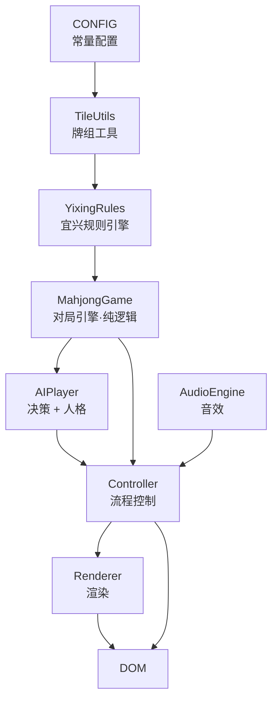

# 宜兴麻将 · 花数规则版

零依赖单文件 HTML5 宜兴麻将游戏：1 个真人玩家 + 3 个 AI 对手。双击即玩，无需安装任何东西。

## 在线试玩

**https://mj.ydtgo.top/**

部署在阿里云 OSS（香港桶 `yixing-mahjong-hk`），已绑定自定义域名并启用 HTTPS。
`master` 分支每次 push 会自动同步到 OSS，见 `.github/workflows/deploy.yml`。

## 为什么做它

网上的麻将游戏要么是日麻规则、要么是简化到没有灵魂的通用规则，**没有一款按宜兴本地花数规则打**。

宜兴麻将的核心特征是「**花数**」而不是「番型」——牌型底花 + 字牌刻杠花累加，再对照 3 花出冲 / 2 花自摸的门槛。这套算法细节多、门槛特例多（独吊、抢杠一包三、暗杠不破门清），用现成引擎改反而比重写更麻烦，所以直接写了个自己的规则引擎。

## 功能

| 模块 | 说明 |
|---|---|
| 牌组 | 144 张：万/饼/条各 36 + 东南西北中发白 28 + **花牌 8 张**（春夏秋冬梅兰竹菊） |
| 补花 | 摸到花牌自动亮出计 1 花，并从牌尾补牌 |
| 副露 | 吃（**仅上家**）、碰、明杠、暗杠、补杠 |
| 计分 | 花数制：牌型底花 + 刻杠花 + 翻倍，实时累计四家分数 |
| 连庄 | 庄家胜或流局连庄，连庄倍数封顶 ×4 |
| AI | 向听数 + 听牌枚举 + 危险牌防守 + 副露决策，三档难度 |
| AI 人格 | 激进 / 保守 / 均衡，可选随机分配或统一风格 |
| 音效 | Web Audio API 程序化生成（无音频文件） |
| 适配 | 响应式断点 ≤620px / ≤400px，手机可玩 |

## 规则速查

### 花数门槛

| 情形 | 要求 |
|---|---|
| 出冲（荣和） | **3 花**起 |
| 自摸 | **2 花**起 |
| 一花独吊 | 可出冲 |
| 无花独吊 | 可自摸 |

### 牌型底花

| 牌型 | 底花 |
|---|---|
| 门清 | 4 |
| 碰碰胡 | 6 |
| 七对 | 10 |
| 清一色 | 8 |
| 混一色 | 6 |
| 十三风 | 13 |

> 多种牌型同时成立，每多一种**各减 1 花**。

### 刻杠花

| 牌 | 碰 | 暗刻 | 明杠 | 暗杠 |
|---|---|---|---|---|
| 中发白、门风 | 2 | 3 | 4 | 5 |
| 其余风牌 | 1 | 2 | 3 | 4 |
| 数牌 | — | — | 1 | 2 |

### 其他

- **翻倍**：天胡、地胡、独吊、海底捞月、杠上开花（×2ⁿ）
- **抢杠**：一包三，独付 6 倍
- **暗杠不破门清**，且不能抢杠
- **吃后不能打同张**
- **放弃过的碰张/胡张，一圈内不能再碰/胡**（轮到自己摸牌后恢复）
- 放冲独付，自摸三家付

## 快速开始

```bash
git clone https://github.com/oracis/yixing-mahjong.git
cd yixing-mahjong
# 直接双击 index.html，或：
start index.html          # Windows
open index.html           # macOS
```

推荐 Chrome / Edge / Firefox 最新版（需支持 Web Audio API 与 CSS `:scope`）。

## 玩法

1. 开始页选择**难度**（简单/普通/困难）与**对手风格**（随机分配/全激进/全保守/全均衡）
2. 点击「开始游戏」
3. 轮到你时**点击手牌出牌**；AI 打出的牌你能碰/杠/吃/和时，底部自动出现按钮
4. 每次和牌后结算面板逐项列出花数明细，可对照上图核账

## 架构

单文件、内部按 IIFE 分层，**引擎层完全不依赖 DOM**（所以能在 Node 里直接跑单测）：



| 模块 | 职责 |
|---|---|
| `CONFIG` | 牌张定义、方位、常量 |
| `TileUtils` | 牌的解析、花色判断、排序键 |
| `YixingRules` | 和牌判定、向听数、听牌枚举、花数计算 |
| `MahjongGame` | 对局状态机（摸/打/碰/吃/杠/和）、一圈限制、连庄 |
| `AIPlayer` | 出牌选择、副露决策、危险度评估、人格与失误建模 |
| `AudioEngine` | Web Audio 程序化音效 |
| `Renderer` | 全部 DOM 渲染，无游戏逻辑 |
| `Controller` | 串联引擎与渲染、处理玩家输入 |

## 开发

改动后建议跑一遍语法校验与逻辑自测：

```bash
# 语法校验（提取 <script> 后交给 node 检查）
node -e "const fs=require('fs');const s=fs.readFileSync('index.html','utf8');\
const m=s.match(/<script>([\s\S]*?)<\/script>/);fs.writeFileSync('_check.js',m[1]);" \
&& node --check _check.js && rm _check.js

# 逻辑自测：用最小 DOM mock 注入脚本，可直接跑完整对局
# 关键：必须挂 uncaughtException / unhandledRejection，
# 否则 setTimeout 里的异常会被静默吞掉（输出为空但 exit=0，极易误判为通过）
```

引擎层无 DOM 依赖，可用约 30 行最小 DOM mock 在 Node 中驱动整局：

```js
const M = new Function('document','window','requestAnimationFrame',
  code + '\n;return {Controller,Renderer,MahjongGame,AIPlayer,YixingRules,TileUtils};'
)(mockDoc, global, cb => setTimeout(cb, 16));

M.Controller.init({ difficulty:'normal', persona:'random' });
M.Controller.startNewRound();
// 然后 dispatch('click') 到具体的手牌 DOM 节点即可
```

### 已知约定

- 排序：万 → 饼 → 条 → 字 → 花，组内数字升序。排序下沉在**所有手牌变更点**（发牌、摸牌、碰/吃/杠后），不要只在摸牌后排。
- 左右两侧（南/北风）手牌用 `flex-direction:column` 竖向叠放，弃牌区放在手牌**内侧**（朝桌面中心），由 `.side-row` 包裹。
- 渲染层引用外部模块必须**显式声明别名**（`const T=TileUtils, C=CONFIG, AI=AIPlayer`）。漏一个别名会抛 `ReferenceError`，而它会被误判成「按钮没绑上」的交互 bug。

## 目录结构

```
yixing-mahjong/
├── index.html    # 全部代码：HTML + CSS + JS
├── README.md
├── LICENSE
└── .gitignore
```

## 待办

- [ ] 十三烂（`shisanlan`）目前只做结构判断，花型细分边界待打磨
- [ ] 蒙特卡洛出牌搜索（当前 AI 是 1 步贪心 + 启发式防守）
- [ ] 出牌/碰杠动画强化

## 免责声明

本项目为个人学习与技术实践作品，规则按宜兴本地打法整理，**各地细则（底花、门槛、翻倍）可能存在差异**，请以你当地实际玩法为准。游戏内 AI 为纯本地规则引擎（非大模型），不使用任何网络请求，不收集任何数据。

## License

[MIT](LICENSE)
