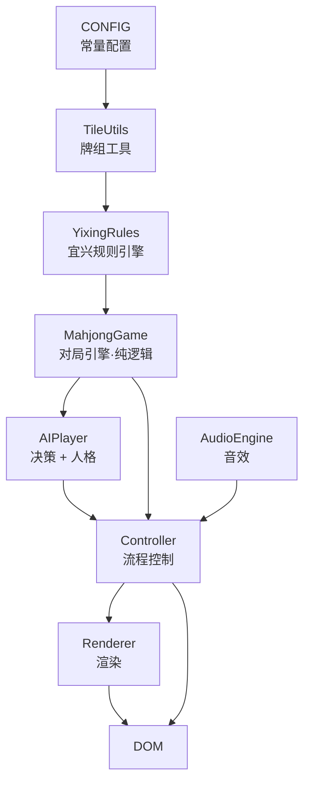

# 宜兴麻将 · 花数规则版

零依赖单文件 HTML5 宜兴麻将游戏：1 个真人玩家 + 3 个 AI 对手。双击即玩，无需安装任何东西。

## 在线试玩

**https://mj.ydtgo.top/**

部署在阿里云 OSS（香港桶 `yixing-mahjong-hk`），已绑定自定义域名并启用 HTTPS。
`master` 分支每次 push 会自动同步到 OSS，见 `.github/workflows/deploy.yml`。

## 为什么做它

网上的麻将游戏要么是日麻规则、要么是简化到没有灵魂的通用规则，**没有一款按宜兴本地花数规则打**。

宜兴麻将的核心特征是「**花数**」而不是「番型」——牌型底花 + 字牌刻杠花累加，再对照 3 花出冲 / 2 花自摸的门槛。这套算法细节多、门槛特例多（独吊、抢杠一包三、暗杠不破门清），用现成引擎改反而比重写更麻烦，所以直接写了个自己的规则引擎。

## 功能

| 模块 | 说明 |
|---|---|
| 牌组 | 144 张：万/饼/条各 36 + 东南西北中发白 28 + **花牌 8 张**（春夏秋冬梅兰竹菊） |
| 补花 | 摸到花牌自动亮出计 1 花，并从牌尾补牌 |
| 副露 | 吃（**仅上家**）、碰、明杠、暗杠、补杠 |
| 计分 | 花数制：牌型底花 + 刻杠花 + 翻倍，实时累计四家分数 |
| 连庄 | 庄家胜或流局连庄，连庄倍数封顶 ×4 |
| AI | 向听数 + 听牌枚举 + 危险牌防守 + 副露决策，三档难度（难度同时影响出牌快慢） |
| AI 人格 | 激进 / 保守 / 均衡，可选随机分配或统一风格 |
| AI 节奏 | 摸牌后停顿 0.85~1.4 秒、约 15% 概率长考至 2.4 秒，**AI 单巡约 1.5 秒**（依据见下） |
| 音效 | Web Audio API 程序化生成（无音频文件） |
| 牌面 | 纯 SVG 手绘 42 种牌面（筒为三色同心圆、条为竹节、一条为燕子），尺寸色值均按参考图实测 |
| 适配 | 横竖屏通吃：四家共享中央牌河、手牌一行永不出屏、长按手牌弹放大条 |

## 规则速查

### 花数门槛

| 情形 | 要求 |
|---|---|
| 出冲（荣和） | **3 花**起 |
| 自摸 | **2 花**起 |
| 一花独吊 | 可出冲 |
| 无花独吊 | 可自摸 |

### 牌型底花

| 牌型 | 底花 |
|---|---|
| 门清 | 4 |
| 碰碰胡 | 6 |
| 七对 | 10 |
| 清一色 | 8 |
| 混一色 | 6 |
| 十三风 | 13 |

> 多种牌型同时成立，每多一种**各减 1 花**。

### 刻杠花

| 牌 | 碰 | 暗刻 | 明杠 | 暗杠 |
|---|---|---|---|---|
| 中发白、门风 | 2 | 3 | 4 | 5 |
| 其余风牌 | 1 | 2 | 3 | 4 |
| 数牌 | — | — | 1 | 2 |

### 其他

- **翻倍**：天胡、地胡、独吊、海底捞月、杠上开花（×2ⁿ）
- **抢杠**：一包三，独付 6 倍
- **暗杠不破门清**，且不能抢杠
- **吃后不能打同张**
- **放弃过的碰张/胡张，一圈内不能再碰/胡**（轮到自己摸牌后恢复）
- 放冲独付，自摸三家付

## 快速开始

```bash
git clone https://github.com/oracis/yixing-mahjong.git
cd yixing-mahjong
# 直接双击 index.html，或：
start index.html          # Windows
open index.html           # macOS
```

推荐 Chrome / Edge / Firefox 最新版（需支持 Web Audio API 与 CSS `:scope`）。

## 玩法

1. 开始页选择**难度**（简单/普通/困难）与**对手风格**（随机分配/全激进/全保守/全均衡）
2. 点击「开始游戏」
3. 轮到你时**点击手牌出牌**；AI 打出的牌你能碰/杠/吃/和时，底部自动出现按钮
4. 每次和牌后结算面板逐项列出花数明细，可对照上图核账
5. 手机上**长按手牌**会弹出放大条，方便认牌（单点=出牌，所以只能长按）
6. **点击左右侧列**（上/下家）弹出该家详情浮层：副露 + 全部弃牌按正常方向放大显示。
   横屏侧列物理上放不下全部弃牌（只能露最近 8~10 张），这是补全信息的唯一途径；
   竖屏也能点，弃牌只有 30px 宽、认不清时点开看大图

## AI 出牌节奏

AI 的「思考时间」全由一个地方控制：`index.html` 里的 `AI_PACE`。改节奏只动它，别去改
`scheduleLoop()` 的 320ms 轮询——那个是玩家和 AI 共用的，加大会直接让玩家点牌变卡。

**关键认知**：AI 本身算完只要 10~300ms，玩家感知到的**完全是停顿**。所以这里调的不是算力，是演出。

| 参考 | 每巡节奏 |
|---|---|
| 雀魂 | 出牌/立直动画 + 角色 cut-in，玩家感知每次动作 **多 1~2 秒** |
| 天凤 | 5 秒/巡（5+10 规则） |
| 世嘉网络麻将（高段） | 1.6 秒/巡，已属偏快一档 |
| 皇家学会 AI 对手实验 | AI 实际 2.5s、扣掉 1~2s 动画后，**感知等待仍要 ~1s** 才舒适 |
| MahjongCopilot 等拟人化打牌 | 明确要「基础延迟随机 + 关键巡额外加时」 |

据此取值为：摸牌后 `850~1400ms`、约 **15% 概率**长考到 `1500~2400ms`、反应碰杠吃
`650~1100ms`。加 320ms 轮询后 **AI 单巡 ≈ 1.5 秒**；难度再乘 0.9 / 1.0 / 1.15（困难档像在深算）。

实测（400×948，同一浏览器会话内把 `pace.for` 就地换成旧值做 A/B）：整桌每张牌平均间隔
**1.08s → 1.54s**，最大停顿 702ms → 1616ms（长考分支确实触发）。

> ⚠️ 调完节奏记得重跑自测：`test/selftest.js` 的「AI 节奏」段会做区间与均值断言，
> 端到端用例的循环预算也是**按 `AI_PACE` 反推**的，不是写死的。

## 手机端布局

> **设计依据（参考来源 · 决策记录 · 断点表 · 实测数据）见 [`docs/layout-spec.md`](docs/layout-spec.md)。**
> 改尺寸或动 Grid 前请先读它；下面只是速查。

一套 DOM + 一个 CSS Grid，横竖屏通吃，不存在「窄屏就把两家藏起来」。

```
┌──────────────────────────────┐
│ topbar  局数 · 余牌 · 轮到谁    │
├──────────────────────────────┤
│  对家（西）信息 + 牌背           │  auto
│  对家弃牌带                     │  auto
│ ┌──────┬───────────┬──────┐   │
│ │ 上家  │  中央：     │ 下家  │   │  1fr
│ │ 信息  │  谁打出了   │ 信息  │   │  ← 富余高度全给这格
│ │ 牌背  │  什么(放大) │ 牌背  │   │     竖屏就是这里的留白
│ │ 弃牌  │  + 提示语   │ 弃牌  │   │
│ └──────┴───────────┴──────┘   │
│  自己弃牌带                     │  auto
├──────────────────────────────┤
│  操作按钮（碰/杠/吃/和）         │  auto
├──────────────────────────────┤
│  自己信息 + 花牌                 │
│  自己手牌（14 张，一行）          │  auto
└──────────────────────────────┘
```

几个必须记住的约束（都是实测撞出来的）：

- **手牌一行塞 14 张**：`--hand-w: min(var(--tile-w), calc((100vw - 51px) / 14))`，
  51px = 左右各 6px 内边距 + 13 个间隙。牌宽高用 `--tile-ar` 锁死比例，
  否则被 flex 挤压后牌面会糊（旧版宽高比从 0.71 掉到 0.52）。
- **方向锁不可用**：`screen.orientation.lock()` 在 iOS Safari 不支持、微信浏览器被拦，
  所以**竖屏必须能玩**，不能指望让用户横过来。
- **上下家那一列给固定宽** `--side-w`：中间那条越宽，对家/自己的弃牌带折行越少、
  越省高度（横屏最缺的正是高度）。
- **横屏（h≤600）中央格压到 0**，两条弃牌带平分高度；竖屏反过来，中央吃富余。
- **后期自动缩档**：每家弃牌 >22 张时给 `#river` 挂 `.tight`（0.78 倍），
  否则弃牌带多折两行会把中央那张「最后打出」挤没。

### CSS 变量的坑

`--mini-h: calc(var(--mini-w) * var(--tile-ar))` 定义在 `:root`，
它的值在 `:root` 上**就算完了**；后代元素继承到的是算好的值。
所以在 `#river` 上覆盖 `--mini-w` **不会**影响 `--mini-h` ——
要么连 `--mini-h` 一起重定义，要么把单位换算写在使用处（本项目用后者）。

## 牌面图案（TileArt）

牌面是纯 SVG 手绘（`viewBox 0 0 100 138`，与牌面 42×58 同比例），全套尺寸由
`scripts/read_ref_tiles.py` **从参考图逐像素量出来**，不是目测估的。

### 配色

用「腐蚀一次取量化众数」采样（腐蚀 = 只留下四邻同色系的像素，即色块/笔画内部）：

| 用途 | 色值 | 对牌面底 `#faf6ea` 对比度 |
|---|---|---|
| 藏蓝（筒/条/字牌/白板框） | `#2d3d67` | 9.84:1 |
| 深红（筒/条/萬） | `#af2b36` | 6.03:1 |
| 竹绿（条/發） | `#16663a` | 6.27:1 |

三点值得记的经验：

1. **别用「最饱和 5% 像素」估色**：会被混色暗边带偏。实测同一张参考图上，
   万字那一行的蓝是偏紫的 `#241464`，而筒点是 `#3c5474` —— 根本不是同一个色，
   混在一起统计只会得到一个谁都不像的中间值。所以脚本**逐行**统计配色。
2. **绿色比参考图（实测 `#3c844c`，对比度只有 4.23:1）刻意调深**：一条竹子的
   描边在 42px 牌面上只有 ~1px，太亮的绿会被抗锯齿糊成浅灰 ——
   这正是之前「条子对比不够」的真正根因（不是配色问题，是亚像素描边问题）。
3. 描边宽度取 `max(3, min(w,h)*0.24)`（viewBox 单位）。低于 3 个单位必被抗锯齿吃掉。

### 布局约定（易错点）

- **圆点不是「空心环 + 实心芯」，是实心圆挖两道白环**：
  `R → 白 0.63R → 彩 0.50R → 白 0.24R → 彩芯 0.13R`，五个比例来自
  「按半径统计彩色像素占比」的剖面测量。
- 一筒是**团花**（藏蓝外圈 + 12 瓣浅绿花环 + 红盘压白十字），不是点阵。
- 六条是 **3 列 × 2 行**（不是 2 列 × 3 行，很容易顺手写错）。
- 七条 = 顶部 1 根红竹 + 下方 3×2，**中间那列是藏蓝**。
- 九条**中间一列**为红；九筒**中间一行**为红 —— 两者红的位置不同。
- 八条是上「W」下「M」：每半 = 2 根竖竹 + 2 根斜竹，合计正好 8 根可数。
  斜竹用 `bambooSeg(x1,y1,x2,y2)`：竹节单元本身是竖直的，绕中心转到
  `atan2(-dx, dy)`（推导见代码注释）。

### 回归防线

`test/selftest.js` 第 0 节断言「**牌面数字 = 可数元素个数**」：
n 筒 = n 个点 × 5 层同心圆、n 条 = n 个 `<rect>`；再校验六/九条的列数、
九条与九筒的红点位置。这类错误肉眼极难发现（六条排成 2×3 看起来也挺自然），
必须靠结构计数兜住。**新加的断言要亲手改坏一次确认它会失败**，否则等于没断言。

## 架构

单文件、内部按 IIFE 分层，**引擎层完全不依赖 DOM**（所以能在 Node 里直接跑单测）：



| 模块 | 职责 |
|---|---|
| `CONFIG` | 牌张定义、方位、常量 |
| `TileUtils` | 牌的解析、花色判断、排序键 |
| `YixingRules` | 和牌判定、向听数、听牌枚举、花数计算 |
| `MahjongGame` | 对局状态机（摸/打/碰/吃/杠/和）、一圈限制、连庄 |
| `AIPlayer` | 出牌选择、副露决策、危险度评估、人格与失误建模 |
| `AudioEngine` | Web Audio 程序化音效 |
| `Renderer` | 全部 DOM 渲染，无游戏逻辑 |
| `Controller` | 串联引擎与渲染、处理玩家输入 |

## 开发

改动后建议跑一遍语法校验与逻辑自测：

```bash
# ① 语法校验：抽出 <script> 交给 node --check
node scripts/_extract_mod.js && node --check scripts/_mods.js

# ② 逻辑自测：最小 DOM mock 注入脚本，自动打完整局（当前 PASS=90）
node test/selftest.js

# ③ 布局几何试算：把 CSS 尺寸变量 + Grid 规则翻译成数字，
#    对 12 个视口检查「手牌一行是否放得下 / 两条弃牌带装不装得下 /
#    中央放不放得下最后打出 / 上下家那列能露出几张」，改尺寸后必跑
node scripts/sim_layout.js

# ④ 真机尺寸截图（用本机 Chrome 无头，见下）
bash scripts/shoot.sh                       # 全部设备
bash scripts/shoot.sh 390x844               # 指定尺寸
HASH='#auto&fill=26' bash scripts/shoot.sh 390x844   # 看后期最挤的样子
```

自测里挂 `uncaughtException` 是为了抓到 `setTimeout` 里的异常，
但它同时会**抑制进程退出**——曾因此出现「PASS/FAIL 一行都不打印但 exit=0」的假绿。
现在 `selftest.js` 在 `process.on('exit')` 里强制兜底打印未捕获异常。

截图工装的两个坑：
- **不要用 `--window-size` 定设备宽度**：Windows 无头 Chrome 会把视口钳到最小 ~504 宽，
  请求 390 实得 504，截图右侧被裁，看起来像「南家不见了」——纯截图假象。
  `scripts/shoot.sh` 改成在页面内放**精确尺寸的 iframe**，外面等比缩放。
- **不要在 node 里 spawn Chrome**（本机沙箱下 `EBUSY`），一律从 bash 调；

引擎层无 DOM 依赖，可用约 30 行最小 DOM mock 在 Node 中驱动整局：

```js
const M = new Function('document','window','requestAnimationFrame',
  code + '\n;return {Controller,Renderer,MahjongGame,AIPlayer,YixingRules,TileUtils};'
)(mockDoc, global, cb => setTimeout(cb, 16));

M.Controller.init({ difficulty:'normal', persona:'random' });
M.Controller.startNewRound();
// 然后 dispatch('click') 到具体的手牌 DOM 节点即可
```

### 已知约定

- 排序：万 → 饼 → 条 → 字 → 花，组内数字升序。排序下沉在**所有手牌变更点**（发牌、摸牌、碰/吃/杠后），不要只在摸牌后排。
- 尺寸变量必须留在**第一个** `:root` 里：`scripts/gen_tiles_preview.py` 只读第一个 `:root`，挪走了会生成一页空白牌。
- 座位映射 `SEAT=[south, east, north, west]` 里的 `east/west` 是**屏幕方位**（右/左），不是风位。
  玩家 0 是「东」但坐屏幕下方；上家（北）在左、下家（南）在右。
- 渲染层引用外部模块必须**显式声明别名**（`const T=TileUtils, C=CONFIG, AI=AIPlayer`）。漏一个别名会抛 `ReferenceError`，而它会被误判成「按钮没绑上」的交互 bug。
- 加新 DOM 查找前先想 `test/selftest.js` 的 mock：`innerHTML` 只是存字符串、不解析成子节点，
  所以断言要查 `_html`（正则）而不是 `_kids.length`；用 `appendChild` 建的才在 `_kids` 里。

## 目录结构

```
yixing-mahjong/
├── index.html            # 全部代码：HTML + CSS + JS（零依赖单文件）
├── layout-preview.html   # 手机端排版预览：多设备 iframe 同屏对比
├── tiles-preview.html    # 牌面图案预览（由 scripts/gen_tiles_preview.py 生成）
├── scripts/
│   ├── _extract_mod.js   # 抽出 <script> → scripts/_mods.js（供 node --check）
│   ├── sim_layout.js     # 布局几何试算（12 个视口）
│   ├── shoot.sh          # 真机尺寸截图（本机 Chrome 无头 + 精确 iframe）
│   ├── gen_tiles_preview.py
│   ├── read_ref_tiles.py # 把牌面参考图读成规格：网格定位 / 配色采样 / 元素测量
│   └── deploy_oss.py     # 推 OSS
├── test/selftest.js      # 最小 DOM mock + 完整对局自测
├── docs/layout-spec.md   # 布局设计依据：参考来源 / 决策记录 / 断点表 / 实测数据
├── .github/workflows/    # push 到 master 自动部署到 OSS
├── README.md
├── LICENSE
└── .gitignore
```

## 待办

- [ ] 十三烂（`shisanlan`）目前只做结构判断，花型细分边界待打磨
- [ ] 蒙特卡洛出牌搜索（当前 AI 是 1 步贪心 + 启发式防守）
- [ ] 出牌/碰杠动画强化

## 免责声明

本项目为个人学习与技术实践作品，规则按宜兴本地打法整理，**各地细则（底花、门槛、翻倍）可能存在差异**，请以你当地实际玩法为准。游戏内 AI 为纯本地规则引擎（非大模型），不使用任何网络请求，不收集任何数据。

## License

[MIT](LICENSE)
